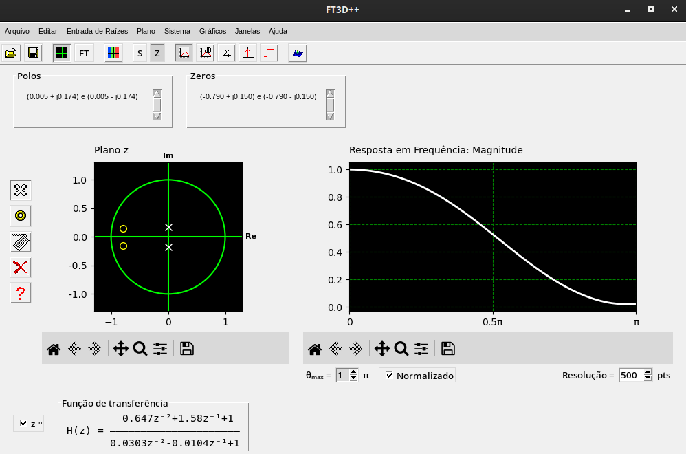

# FT3D++

[FT3D](https://www.abenge.org.br/cobenge/legado/arquivos/18/trabalhos/NTM090.pdf) rewrite

<p align="center" width="100%">

</p>

## Install dependencies
### Debian Linux packages
```sh
sudo apt install python3-matplotlib python3-numpy python3-tk
```

### or from PyPI with pip

#### Linux
```sh
python3 -m venv .venv
. .venv/bin/activate
pip install -r requirements.txt
```

#### Windows
```sh
python -m venv venv
Set-ExecutionPolicy -Scope CurrentUser -ExecutionPolicy RemoteSigned
venv\Scripts\activate
pip install -r requirements.txt
```

## Run

### Linux
```sh
python3 src/main.py
```

### Windows
```sh
python src/main.py
```

## Features
### FT3D Features
- [x] Visual insertion in z plane
- [ ] Visual insertion in s plane
- [x] Keyboard insertion in z plane
- [ ] Keyboard insertion in s plane
- [ ] Transfer function insertion
- [x] Clear all insertions
- [x] Frame with poles and zeros coordinates
- [x] Magnitude plot for z plane
- [x] Magnitude plot in dB for z plane
- [x] Phase plot for z plane
- [ ] Magnitude plot for s plane
- [ ] Magnitude plot in dB for s plane
- [ ] Phase plot for s plane
- [ ] s <-> z mapping
- [ ] 3D plot
- [ ] 3D plot customization
- [ ] 3D plot navigation
- [x] 2D plot navigation
- [x] Choose frequency response limits from z plane
- [ ] Choose frequency response limits from s plane
- [ ] Topography heat map plot
- [ ] Topography heat map customization
- [ ] System classification
- [ ] System classification reasons
- [ ] Impulse response plot
- [ ] Choose impulse response sample size
- [ ] Step response plot
- [ ] Choose step response sample size
- [ ] Choose plane limits
- [ ] Save plot
- [ ] Save system
- [ ] Choose plot colors
- [x] Show mouse coordinates below 2D plots
- [ ] Show mouse coordinates below 3D plots
- [ ] Show magnitude value below z plane
- [ ] Show magnitude value below s plane
- [ ] Show magnitude and phase values below both plots
- [ ] Allow exact frequency response at from mouse x position
- [ ] Choose sample rate
- [ ] Calculate minimum phase system
- [ ] Calculate maximum phase system
- [ ] Calculate inverse phase system
- [ ] Undo insertion
- [ ] Redo insertion
- [ ] Undo mapping
- [ ] Redo mapping
- [ ] Shortcuts to close app and to open and save files
- [ ] Help page
### New Features
- [x] Choose frequency response resolution
- [x] Choose phase unit
- [x] Choose normalized frequency response
- [x] Labels for plane axes
- [ ] Shortcuts to undo and redo insertion
- [x] Choose transfer function format
- [x] Padding between related buttons
- [x] Window resize
- [ ] Plot resize along window resize
- [x] Save plot in multiple formats
- [x] Allow poles and zeros removal regardless of which one is selected
- [ ] Allow poles and zeros move regardless of which one is selected
- [ ] Show number of poles and zeros
- [ ] Add button hints
- [ ] Choose to add spaces inside transfer function
- [ ] Choose font size of transfer function
- [ ] Choose font size of coordinates
- [ ] No button duplication in menu
- [ ] Translations

## License
[GPLv3](./LICENSE)

Copyright 2026 Omar Zagonel El Laden
